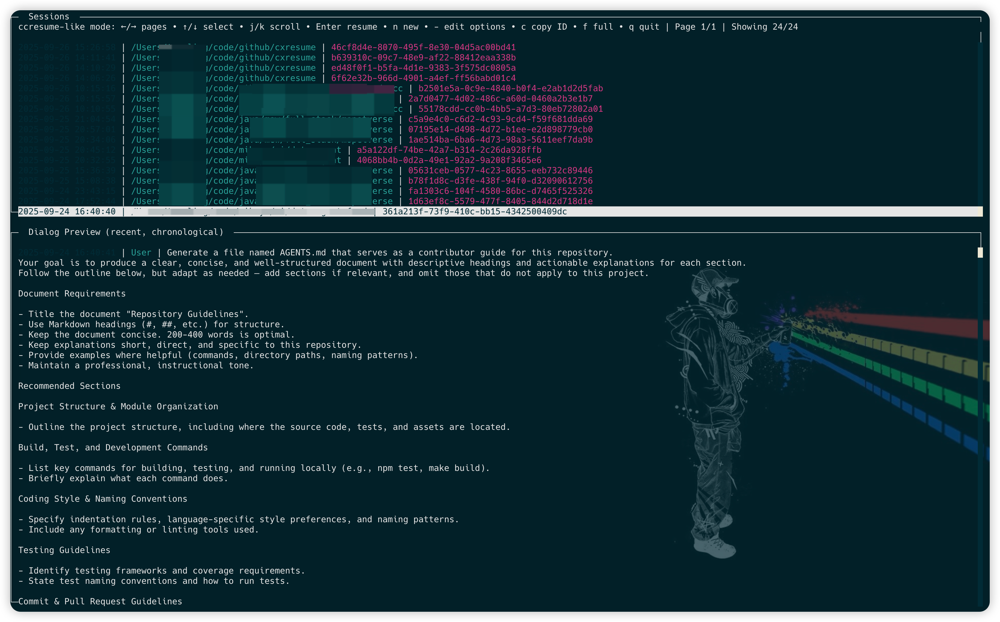

cxresume（Codex Resume CLI）
===========================
[](https://www.npmjs.com/package/cxresume)

[English](./README.md)



Codex Resume（cxresume）是一个用于“继续/恢复 Codex 会话”的命令行/TUI 小工具：从 `~/.codex/sessions` 加载历史记录（load sessions from history），将完整对话压缩为单个 Primer，并启动 Codex 让你在原处继续（resume Codex sessions）。如果你在搜索 “codex resume”、“resume codex sessions” 或 “load sessions from history”，这个工具正是为此场景而生。

安装

- Node.js 18+
- 全局安装（推荐）：`npm i -g cxresume`
- 验证：`cxresume --help`
- 升级：`npm i -g cxresume@latest`
- 卸载：`npm uninstall -g cxresume`

提示：一次性运行可使用 `npx cxresume --help`

快速开始

- 运行 `cxresume` 打开分屏 TUI：上半区列出会话，下半区展示最近对话预览。按 Enter 后，直接恢复 Codex 会话（resume Codex sessions）：cxresume 将“压缩后的全量历史”作为单个命令行参数传给 `codexCmd`，若参数过长会自动降级为 pty/剪贴板注入。

为什么是 cxresume

- 即刻从历史日志恢复 Codex 会话
- 一条命令搜索并加载历史记录（load sessions from history）
- 有损压缩，在预算内最大化保留上下文
- 支持交互式 TUI 与非交互 CLI
- 无需项目配置，只需指向 Codex 日志目录

按键说明

- 列表导航：`↑/↓` 选择；`←/→` 翻页
- 预览滚动：`j/k`
- 启动会话：`Enter`
- 新建会话：`n`（在该会话记录的目录中启动，不注入 Primer）
- 临时添加参数：`-`（为本次启动临时追加到 `codexCmd`）
- 复制会话 ID：`c`
- 切换全屏预览：`f`
- 退出：`q` 或 `Esc`

命令行选项

- `--list` — 列出最近的会话文件
- `--open <file>` — 打开具体的 jsonl 文件（相对根目录或绝对路径）
- `--root <dir>` — 覆盖会话根目录（默认 `~/.codex/sessions`）
- `--codex <cmd>` — 覆盖 Codex 启动命令（默认 `codex`）
- `--search <text>` — 全量搜索后选择
- `--legacy-ui` — 旧版单列选择器（无分屏预览）
- `--preview` / `--no-preview` — 启动前是否显示简短预览
- `--print` — 仅打印构建好的 Primer 并退出
- `--no-launch` — 不启动 Codex（通常配合 `--print` 使用）
- `-y`, `--yes` — 跳过交互确认
- `-h`, `--help` — 帮助
- `-v`, `--version` — 版本

筛选

- 当前目录筛选：`cxresume .` 仅显示日志中 `cwd` 等于当前目录的会话（尽力而为，依赖日志中是否记录 `cwd`）。

配置

- 配置文件：`~/.config/cxresume/config.json`

```
{
  "logsRoot": "/home/me/.codex/sessions",
  "codexCmd": "codex",
  "preview": false,
  "inject": "inline",
  "injectDelayMs": 1000,
  "injectWakeEnter": false,
  "injectWakeDelayMs": 250,
  "inlineArgMaxChars": 120000,
  "primerAllPerMessageMax": 400,
  "primerAllTargetChars": 10000
}
```

- 关于 `codexCmd`：
  - 默认情况下，cxresume 会将 Primer 作为最后一个单参数追加到 `codexCmd`。
  - 也可以在 `codexCmd` 中使用 `{contextInline}` 指定插入位置，例如：`"codex chat --system {contextInline}"`。

工作原理

- 从会话根目录发现 `*.jsonl` 日志。
- 解析文件：第一行期望是 `session_meta`；对话消息来自 `type=event_msg` 且 `payload.type ∈ { user_message, agent_message }`。
- 构建“全量压缩 Primer”（用于从历史记录恢复会话）：
  - 一个 System 指令块，提示 Codex 静默吸收上下文。
  - 会话元信息（ID、时间范围、消息数）。
  - 按时间顺序包含所有对话消息；每条内容按配置做长度截断，整体受总预算限制。
- 将 Primer 作为单个命令行参数传入 `codexCmd` 启动。若参数太长，则自动降级为 pty/剪贴板注入。

也叫 / 关键词

- codex resume
- resume codex sessions
- load sessions from history

示例

- 交互选择并启动：
  - `cxresume`

- 仅显示当前目录的会话：
  - `cxresume .`

- 先搜索再选择：
  - `cxresume --search 构建脚本`

- 打开并直接启动：
  - `cxresume --open 2025/09/24/session.jsonl -y`

许可协议

MIT
